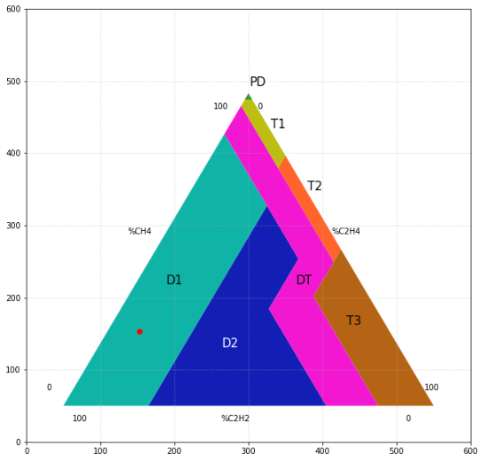

# Duval triangle
A Duval triangle is a diagram used for fault type identification in dissolved-gas analysis of oil-filled high-voltage transformers and other electrical apparatus.

In the following picture you can see an example of a Duval's triangle plot. To enter a value you need to edit the line 41 (sample_point variable). You have to enter the %CH<sub>4</sub>, %C<sub>2</sub>H<sub>2</sub> and the %C<sub>2</sub>H<sub>4</sub> values to get the plot.

```
sample_point = np.array([8.6,23.9,  1]) @ np.transpose(A)
```



The areas on the plot are:
* PD - Partial discharges of corona type
* D1 - Discharges of low energy or partial discharges of sparking type
* D2 - Discharges of high energy
* T1 - Thermal fault, t $\leq$ 300 °C
* T2 - Thermal fault, 300 °C < t < 700 °C
* T3 - Thermal fault, t $\geq$ 700 °C 
* DT - Combitnations of thermal and electrical dischrge faults


**Soon there will be a standalone .exe app**
